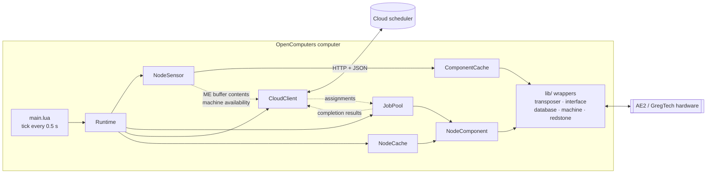

# AE2MES

An OpenComputers node client for AE2/GT automation in GregTech: New Horizons.

A node watches one ME network, reports what it holds and which GregTech
machines are free, asks a cloud scheduler what to run, and then drives the
transposers, ME interfaces, databases, and redstone needed to execute the
assignment it gets back. One computer runs one node; the scheduler decides what
that node does.

## How it fits together



The split is deliberate: [`lib/`](lib/README.md) only knows about hardware, and
[`src/`](src/README.md) only knows about decisions. A wrapper in `lib/` never
touches an assignment; a module in `src/` never calls `component.invoke`.

| Path | Purpose | Docs |
|------|---------|------|
| `lib/` | Hardware component wrappers and the `NodeComponent` composite | [lib/README.md](lib/README.md) |
| `src/` | Runtime loop, sensing, scheduling, cloud transport | [src/README.md](src/README.md) |
| `spec/` | Busted specs and standalone unit scripts | — |
| `features/` | Gherkin scenarios and shared step helpers | — |
| `fixtures/` | Mock assignment payload for offline runs | — |
| `scripts/manual/` | In-game hardware smoke tests, not run in CI | [scripts/manual/README.md](scripts/manual/README.md) |

## Running a node in game

1. Copy `src/`, `lib/`, and `fixtures/` onto the OpenComputers computer,
   preserving the directory layout. `main.lua` expects to run from the
   directory that contains `src/` and `lib/`.
2. Edit the config table in `src/main.lua`: set `clusterId`, `cloudBaseUrl`, and
   the `meControllerAddr` of the ME controller this node watches.
3. Run `main.lua`.

The computer needs an internet card for cloud traffic, plus adapters for
whichever devices the assignments reference.

### Configuration

Everything is a single flat table in `src/main.lua`:

```lua
local config = {
    clusterId = "cluster-alpha",
    cloudBaseUrl = "https://example.ngrok-free.dev",
    meControllerAddr = "61df706b-463f-453f-ba71-c2c43a79e12a",
    machineFilter = "gt_machine",
    statusInterval = 30,
    statusRetryDelay = 15,
    jobRequestCooldown = 15,
}
```

The full key list, with defaults, is in
[src/README.md](src/README.md#mainlua). URLs containing `ngrok` automatically
get the browser-warning bypass header.

### Offline mock mode

To exercise the real hardware pipeline without a cloud server, set
`useMockAssignment = true` in the config and edit
`fixtures/mock_assignment.json` with the machine, transposer, and interface
addresses plus side numbers for one physical machine. The broker discovers its
ME controller, database, and redstone components locally. `CloudClient` then
serves assignments from that file, and status and completion calls just print
locally.

The fixture's `sequenceFlow.items` and `fluids` can stay empty — mock mode
overwrites them from the live ME buffer on every request, so the fixture stays
valid as the network changes. A request only fires after `NodeSensor` observes
a buffer change, so change something in the ME network to kick off the first
job. The same buffer is staged in the locally discovered database before cloud
or mock submission; this single shared staging database supports one returned
assignment per request.

## The cloud contract

Four endpoints, all JSON:

| Method | Endpoint | Payload |
|--------|----------|---------|
| POST | `/clusters/{clusterId}/initialize` | discovered globals/components → approved mappings and topology revision |
| POST | `/clusters/{clusterId}/jobs/request` | buffer contents, ready machine availability, active jobs → `assignments[]` |
| GET | `/jobs/{jobId}` | → a single assignment |
| POST | `/clusters/{clusterId}/status` | heartbeat with topology revision, machine states, and active jobs |
| POST | `/jobs/{jobId}/complete` | terminal result uplink |

An assignment tells the node which machine to use, how that machine is wired,
and what sequence of operations to run:

```json
{
  "jobId": "job-mock-001",
  "machineAddress": "<gt machine address>",
  "registry": {
    "machineAddress": "<gt machine address>",
    "transposerAddress": "<transposer address>",
    "interfaceAddress": "<me interface address>",
    "transposerSides": { "pull": 5, "input": 0, "returnSide": 2 },
    "redstoneSides": { "start": 0, "stop": 1 }
  },
  "sequenceFlow": {
    "items": [],
    "fluids": [],
    "steps": [
      { "method": "transferToMachine", "params": {} },
      { "method": "waitForProcess", "params": { "timeout": 600 } }
    ]
  }
}
```

`registry` identifies per-machine hardware; the broker-global ME controller,
database, and redstone addresses come from local OpenComputers discovery.
Sides remain named roles so the same step definitions work on differently
wired machines. `steps` are executed in order, one step at a time, across
successive runtime ticks. Supported step methods today are `transferToMachine`
(alias `transfer`), `waitForProcess` (alias `process`), and `wait`; anything
else faults the job.

## Tests

Specs run on Lua 5.2 with [Busted](https://lunarmodules.github.io/busted/) and
never touch real hardware — `features/support/mock_oc.lua` provides a fake
OpenComputers component library that the wrappers accept through their
`opts.component` injection point.

### Docker (recommended)

```powershell
docker build -f Dockerfile.test -t ae2-es2-test .
docker run --rm ae2-es2-test
```

### Locally

```bash
luarocks install busted
./scripts/run_tests.sh
```

`run_tests.sh` runs `spec/cloud_client_mock_unit.lua` and
`spec/runtime_database_unit.lua` as plain Lua scripts, then hands off to
Busted, which collects `spec/*_spec.lua`. The specs reuse the Gherkin step
definitions in `features/support/` through a shim, so a scenario in
`features/job_pool.feature` and the matching spec exercise the same steps.

Note that `spec/job_pool_unit.lua` is a standalone script in the same style as
the cloud-client one, but nothing currently invokes it — Busted's default
pattern only matches `_spec`, and `run_tests.sh` does not name that file. Run
it directly with `lua spec/job_pool_unit.lua` from the repository root.

### In-game validation

Automated tests cannot cover transposer sides, redstone wiring, or GregTech
recipe behavior. `scripts/manual/` holds armed, explicitly confirmed smoke
tests for those; see [scripts/manual/README.md](scripts/manual/README.md) for
the discover-then-arm procedure and expected pass counts.

## Extending

The two most common changes have step-by-step guides:

- **New hardware device** — add a `BaseComponent` subclass in `lib/`, register
  it in `ComponentCache.WRAPPER_CLASSES`, and optionally hang it off `NodeComponent`.
  See [extending lib/](lib/README.md#extending).
- **New assignment operation** — add a multi-device method to `NodeComponent`,
  then a dispatch case in `JobPool:tickRun`. See
  [adding a new step case](src/README.md#adding-a-new-step-case).

Two conventions hold everywhere and are worth knowing before your first change:
component wrapper methods return `value, error` instead of raising, and the
runtime treats every cloud failure as retryable rather than fatal. A step
handler that blocks or raises breaks the cooperative tick loop that the whole
node depends on.
