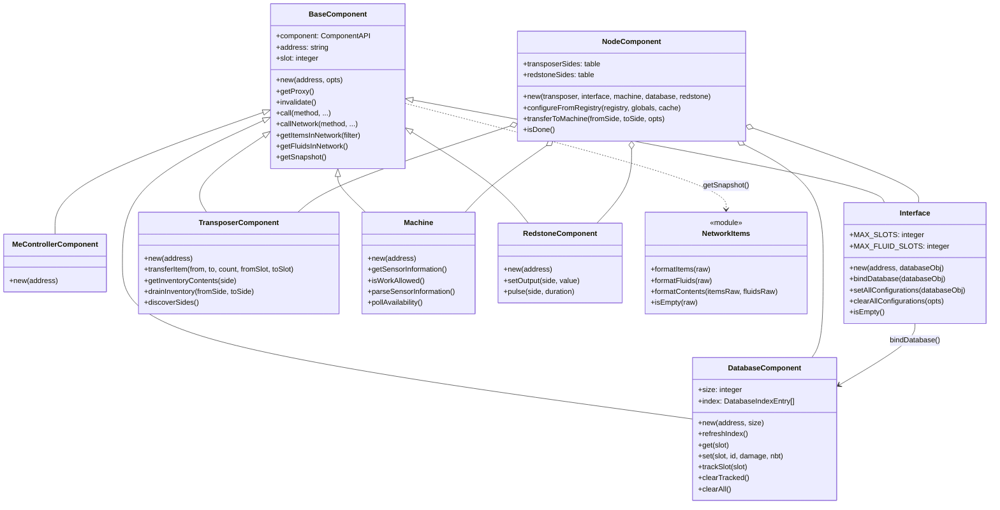
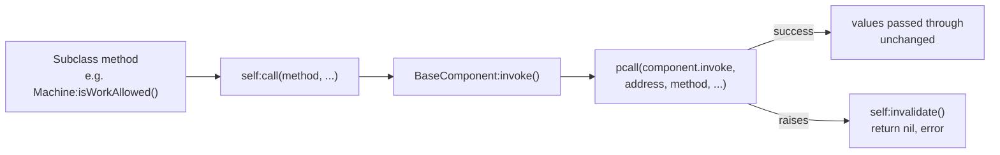
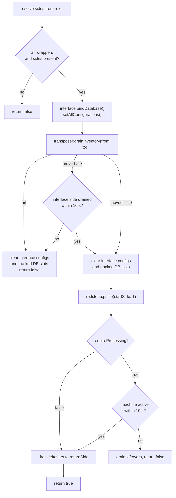
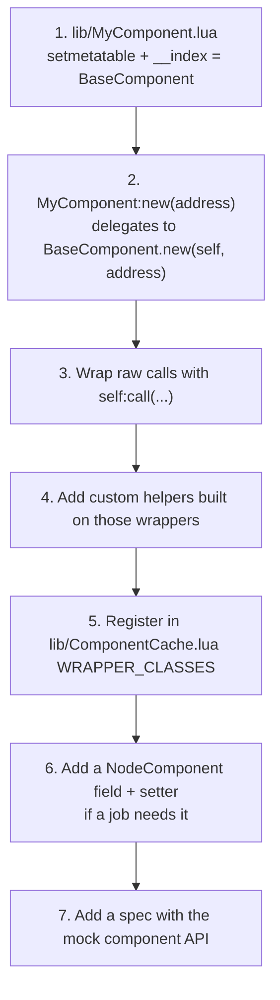

# `lib/` — hardware wrappers and composition

Everything in `lib/` talks to OpenComputers hardware or formats what hardware
returns. Nothing here knows about the cloud, assignments, or scheduling; that
lives in [`src/`](../src/README.md).

Load these modules by bare name — `main.lua` puts `./lib/?.lua` on
`package.path`, so `require("Machine")` resolves without a path prefix.

## Contents

| Module | Kind | Purpose |
|--------|------|---------|
| `BaseComponent.lua` | Class | Address/proxy lifecycle, safe invocation, AE2 CommonNetworkAPI methods |
| `MeControllerComponent.lua` | Subclass | ME controller; adds nothing beyond the inherited network API |
| `DatabaseComponent.lua` | Subclass | AE2 database slots plus a cached non-empty slot index |
| `Interface.lua` | Subclass | ME interface item/fluid stocking driven by a bound database |
| `TransposerComponent.lua` | Subclass | Item movement between adjacent inventories, side discovery |
| `Machine.lua` | Subclass | GT machine telemetry and sensor-line parsing |
| `RedstoneComponent.lua` | Subclass | Redstone output levels and pulses |
| `NodeComponent.lua` | Composite | Aggregates the wrappers for one machine and runs the transfer pipeline |
| `ComponentCache.lua` | Identity | Reuses hardware wrappers keyed by `className:address` |
| `NetworkItems.lua` | Pure functions | Normalizes raw AE2 item/fluid results into plain snapshot tables |
| `Comms.lua` | Singleton | Serialized HTTP/JSON/TCP over the internet card |
| `JSON.lua` | Vendored | Jeffrey Friedl's pure-Lua JSON encoder/decoder |

## Inheritance and composition

Every hardware wrapper inherits from `BaseComponent` through
`setmetatable({}, { __index = BaseComponent })`, so each subclass gets the
address lifecycle, `call`/`callNetwork`, and the whole CommonNetworkAPI surface
for free. `NodeComponent` deliberately sits outside that hierarchy: it owns no
single address, so it composes wrappers instead of inheriting from one.



### How a call reaches the hardware



Two conventions follow from this and hold across the whole directory:

- **Instance methods return `value, error`.** A raised component exception
  becomes `nil, "<message>"` rather than propagating, and it drops the cached
  proxy so the next `getProxy` re-resolves.
- **Class-level helpers propagate.** `BaseComponent.list`, `.getPrimary`,
  `.resolve`, and friends call the default component library directly, so their
  errors are raised, not returned.

## Reference

### `BaseComponent`

Constructor: `BaseComponent:new(address, opts)` → `component | nil, error`.
`opts.component` injects a fake component library, which is how the specs run
without OpenComputers. The constructor caches the physical slot but does *not*
create a proxy; the first `getProxy()` does that and memoizes it.

| Group | Methods |
|-------|---------|
| Identity | `getAddress`, `getType`, `getSlot`, `getProxy`, `invalidate` |
| Invocation | `invoke`, `call`, `callNetwork`, `doc`, `methods` |
| Class-level | `component`, `docFor`, `invokeFor`, `list`, `methodsFor`, `proxyFor`, `typeFor`, `slotFor`, `resolve`, `isAvailable`, `getPrimary`, `setPrimary` |
| AE2 network | `allItems`, `getItemsInNetwork`, `getFluidsInNetwork`, `getEssentiaInNetwork`, `store`, `getCpus`, `getCraftables` |
| AE2 power | `getAvgPowerInjection`, `getAvgPowerUsage`, `getMaxStoredPower`, `getStoredPower`, `getIdlePowerUsage` |
| Formatting | `getSnapshot` → `{ items, fluids }` via `NetworkItems.formatContents` |

`call` and `callNetwork` are currently the same code path. The pair exists so
that call sites document which API they are targeting, and so the network path
can diverge later without touching every subclass.

### `DatabaseComponent`

`DatabaseComponent:new(address, size)` defaults `size` to 9 and immediately
scans slots 1..size into `self.index`. Per-slot component errors are
indistinguishable from empty slots and are skipped.

`get`, `set`, `clear`, `copy`, `clone`, `indexOf`, `computeHash`, `getSize`,
`trackSlot`, `clearTracked`, `clearAll`, `refreshIndex`. Individual slot
mutations do **not** refresh `self.index`. `clearTracked` and `clearAll` reset
their tracking state and refresh the index after clearing.

### `Interface`

`Interface:new(address, databaseObj)`. Passing a database binds it immediately.
`bindDatabase` builds a plan mapping database index entries onto interface slots:
solid items fill item slots 1..9, AE2FC fluid drops fill fluid sides 1..6, and
anything past those limits is dropped.

`setAllConfigurations(databaseObj)` applies the plan and records the touched
slots in `_trackedConfigs`; `clearAllConfigurations(opts)` clears exactly those
tracked slots when available, and otherwise falls back to scanning every slot.
Both ignore individual component failures. `isEmpty()` reports whether the
interface's normalized snapshot has no items and no fluids.

### `TransposerComponent`

`transferItem`, `getInventorySize`, `getInventoryName`, `getAllStacks` are thin
passthroughs. The two custom helpers are the ones jobs actually use:

- `getInventoryContents(side)` normalizes whatever shape `getAllStacks` returns
  (array, object with `getAll`, or iterator) into a plain entry array.
- `drainInventory(fromSide, toSide)` issues one transfer per non-empty stack and
  stops at the first failure, returning the partial count alongside the error.

`discoverSides()` probes sides 0–5 and returns a map keyed `Down`, `Up`,
`North`, `South`, `West`, `East` for sides that expose an inventory.

### `Machine`

Roughly thirty GT getters (`getStoredEU`, `getWorkProgress`, `isWorkAllowed`,
`getSensorInformation`, …) sit on top of two scheduler-facing methods:

- `parseSensorInformation()` strips `§` formatting codes and pattern-matches the
  English GTNH labels into `progress`, `energy`, `tier`, `problems`,
  `efficiency`, and `pollutionReduction`. Unmatched lines land in `unknown`.
- `pollAvailability()` returns a `MachineAvailability` record with an
  `unavailableReason` built from the codes `work_disabled`, `processing`,
  `recipe_complete`, and `problems:<n>`. `available` is true only when that
  reason list is empty.

Because the parser matches English label text, a localized or modified GTNH
install will degrade to empty progress fields rather than raising.

### `RedstoneComponent`

`setOutput(side, value)` and `pulse(side, duration)`. `pulse` writes 15, sleeps,
then writes 0 — it does not restore the previous level, and a failure on the
second write can leave the output high.

### `NodeComponent`

The composite. `configureFromRegistry(registry, globals, cache)` accepts either
a raw table or an object with a `get` method (an `Assignment` `Registry`). It
reads per-machine machine/transposer/interface addresses and both side maps
from the registry, while database and redstone wrappers come from locally
discovered `globals` through ComponentCache. Legacy cloud database/redstone
addresses are ignored.

`transposerSide(role)` and `redstoneSide(role)` resolve a role name such as
`"pull"`, `"input"`, `"returnSide"`, `"start"`, or `"stop"` to a numeric side;
numbers pass through unchanged.

`transferToMachine(fromSide, toSide, opts)` is the pipeline:



`isDone()` reports completion from `pollAvailability`, either because progress
reached its maximum or because the reason list contains `recipe_complete`.

> Two known rough edges in `transferToMachine`: it reads and writes the globals
> `startSide` and `stopSide` instead of locals, and it calls
> `self.redstone:pulse(...)` in a way that assumes a dot-defined `pulse`. Fix
> these before relying on multiple concurrent nodes in one Lua state.

### `NetworkItems`

Pure formatting, no component I/O. `formatItems`, `formatFluids`,
`formatContents`, `isEmpty`, plus the single-entry converters
`toSnapshotItem`, `toSnapshotFluid`, and `fluidDropToSnapshot`. It reads both
direct fields and Java-style getters, tolerates array/iterator/userdata
collections, and deduplicates. `formatContents` merges AE2FC fluid drops found
in the item list into the fluid list.

### `Comms`

A module-level singleton (not instantiated) wrapping the internet card.
`request`, `requestJSON`, `requestJSONPost`, `send`, `sendJSON`, `socket`,
`open`. All body-reading calls pass through a process-wide busy gate so only one
HTTP request is in flight at a time, and URLs containing `ngrok` automatically
get the `ngrok-skip-browser-warning` header.

## Extending

### Adding a new hardware wrapper

Use this when a new device type needs its own OpenComputers calls. The pattern
is identical across all five existing subclasses.



```lua
---@class MyComponent : BaseComponent
local BaseComponent = require("BaseComponent")

local MyComponent = setmetatable({}, { __index = BaseComponent })
MyComponent.__index = MyComponent

---@param address string
---@return MyComponent|nil component
---@return string|nil error
function MyComponent:new(address)
    local self, err = BaseComponent.new(self, address)
    if not self then
        return nil, err
    end
    return self
end

---Wrap one raw component method.
---@param side integer
---@return boolean|nil ok
---@return string|nil error
function MyComponent:doThing(side)
    return self:call("doThing", side)
end

return MyComponent
```

The `BaseComponent.new(self, address)` call is the important detail: passing
`self` (the subclass table) as the first argument makes `setmetatable({}, self)`
inside the base constructor use your subclass as the metatable, so instances get
your methods *and* inherit the base ones.

Then wire it up:

1. Add the class name to `WRAPPER_CLASSES` in `lib/ComponentCache.lua`, or
   `ComponentCache:getComponent` will reject it as an unknown class.
2. If jobs need it per-machine, add a field, a `setX(address)` setter, a
   `getX()` accessor, and a `registryAddress(registry, "xAddress")` branch in
   `NodeComponent:configureFromRegistry`.
3. Add a spec under `spec/`, injecting a fake component library through
   `opts.component` so no hardware is required.

### Adding hardware behavior to an existing wrapper

Put it on the wrapper that owns the device. A helper that reads a transposer
belongs on `TransposerComponent`, not in `NodeComponent` — `NodeComponent` should
only orchestrate across devices. Build custom helpers on top of `self:call`
wrappers rather than calling `component.invoke` directly, so error handling and
proxy invalidation stay consistent.

### Adding a multi-device workflow

Those go on `NodeComponent`, next to `transferToMachine`. Resolve sides through
`transposerSide` / `redstoneSide` so cloud assignments can name roles instead of
hard-coding numbers, guard on the wrappers you need being present, and return
`false` rather than raising when wiring is incomplete — `JobPool` treats a
non-`true` return as a faulted job. Once the method exists, expose it to
assignments by adding a step case in
[`src/JobPool.lua`](../src/README.md#adding-a-new-step-case).
