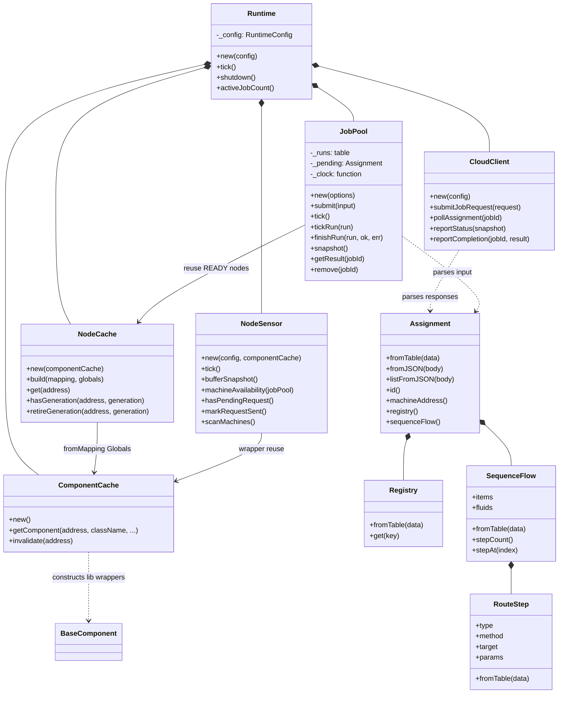
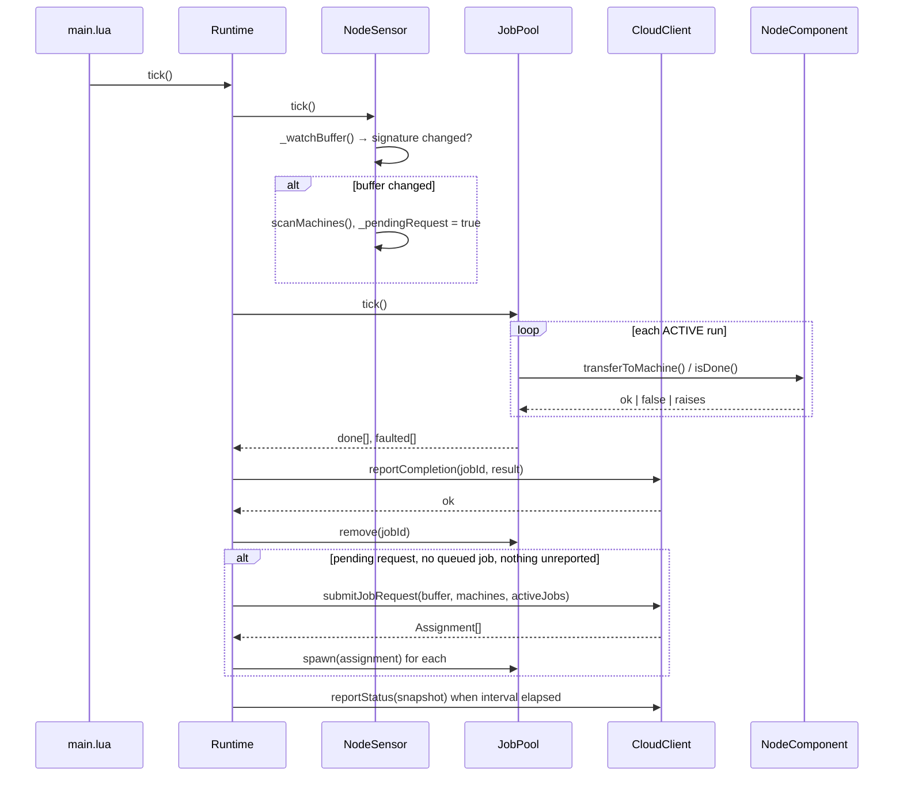
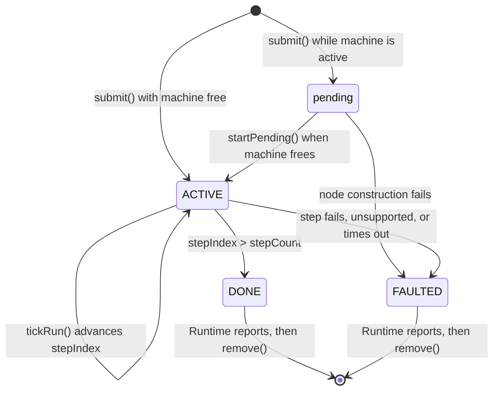
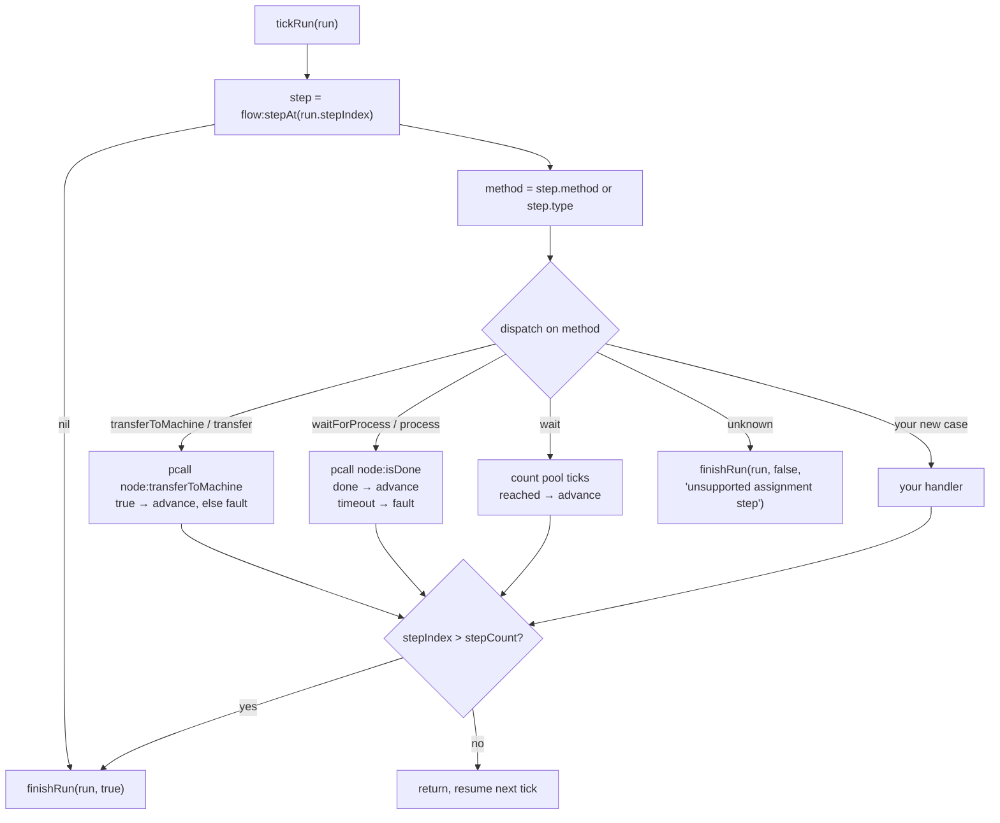

# `src/` — runtime, scheduling, and cloud

`src/` is the decision-making half of the node client. It senses what the ME
network holds, asks the cloud what to do, drives assignments step by step
through the hardware wrappers in [`lib/`](../lib/README.md), and reports
results back.

`main.lua` prepends `./src/?.lua;./lib/?.lua` to `package.path`, so every module
here is loaded by bare name.

## Contents

| Module | Kind | Purpose |
|--------|------|---------|
| `main.lua` | Entry point | Builds `RuntimeConfig` and ticks the runtime every 0.5 s |
| `Runtime.lua` | Coordinator | Owns the sensor, cloud client, job pool, ComponentCache, and NodeCache; one `tick` drives everything |
| `NodeSensor.lua` | Sensor | Watches the ME buffer for change, scans GT machines |
| `CloudClient.lua` | Transport | Job requests, status heartbeats, completion uplinks, mock fixture mode |
| `Assignment.lua` | Parser | `Assignment`, `Registry`, `SequenceFlow`, `RouteStep` value objects |
| `JobPool.lua` | Executor | Parses, queues, advances, and finishes assignment runs |
| `NodeCache.lua` | Topology | READY `NodeComponent` generations keyed by machine address |
| `HardwareDiscovery.lua` | Discovery | Resolves broker-global ME controller, database, and redstone addresses |

None of these inherit from each other. Composition and plain value objects are
the pattern throughout — the only inheritance in the project is the
`BaseComponent` hierarchy in `lib/`.

## Object graph



## One runtime tick



The ordering matters. Results are flushed to the cloud *before* a new job
request goes out, and `Runtime:tick` only requests work when the pool has no
pending assignment and nothing left unreported — so the node never has more
than one queued assignment in flight.

## Reference

### `main.lua`

Not a module. It sets `package.path`, defines a `RuntimeConfig` table, and loops
`runtime:tick()` with `os.sleep(0.5)`. Recognized config keys:

| Key | Default | Meaning |
|-----|---------|---------|
| `clusterId` | `"unknown-cluster"` | Identifies this hardware cluster to the cloud |
| `cloudBaseUrl` | `""` | Prefix for every cloud endpoint |
| `meControllerAddr` | discovered | Optional override for the first local `me_controller` |
| `bufferSourceAddress` | — | Legacy fallback override when `meControllerAddr` is absent |
| `databaseAddress` | discovered | Optional override for the first local `database` |
| `redstoneAddress` | discovered | Optional override for the first local `redstone` |
| `databaseSize` | `9` | Number of slots in the broker-global staging database |
| `machineFilter` | `"gt_machine"` | Component-type filter for machine discovery |
| `statusInterval` | `30` | Seconds between successful heartbeats |
| `statusRetryDelay` | `15` | Backoff after a failed heartbeat |
| `jobRequestCooldown` | `15` | Minimum seconds between job requests |
| `useMockAssignment` | `false` | Serve assignments from a local fixture |
| `mockAssignmentPath` | `fixtures/mock_assignment.json` | Fixture location |

### `Runtime`

`Runtime.new(config)` discovers the broker-global ME controller, database, and
redstone component, constructs their shared cached wrappers, and clears the
database before constructing the cloud client, sensor, and job pool. Explicit
addresses in config override discovery. Public surface is `tick()`, `shutdown()`,
and `activeJobCount()`. The private helpers `_storeBufferInDatabase`,
`_maybeReportStatus`, `_submitJobRequest`, `_handleFinishedJobs`, and
`_logNoAssignments` implement the sequence above.

When a changed buffer is submitted, `_storeBufferInDatabase` first writes the
same item/fluid records into consecutive database slots through the discovered
ME controller. Item slots use name/damage/count filters; fluids use AE2FC
`drop of <label>` filters. A failed store leaves the request pending and skips
cloud submission, with partial writes rolled back first. Successful slots
remain tracked until the transfer pipeline clears them. Because one global
database is shared, Runtime accepts at most one assignment per request; a
larger response is rejected and its staged slots are cleared.

Cloud failures are printed and retried, never raised. `_logNoAssignments`
deduplicates the "no work returned" diagnostic using a signature built from the
first eight buffer items and the machine count, so an idle node does not flood
the console.

### `NodeSensor`

`NodeSensor.new(config, componentCache)`.

- `tick()` polls the ME controller through the ComponentCache and compares a reduced
  content signature (names plus quantities, order-independent) against the last
  one. Only a change marks a request pending and triggers a machine scan.
- `hasPendingRequest()` is true only when a change is pending *and*
  `jobRequestCooldown` has elapsed since `markRequestSent()`.
- `machineAvailability(jobPool)` returns a copied array of the last scan with a
  `busy` flag applied from the pool's active machine addresses.
- `scanMachines()` enumerates `component.list(machineFilter)` and calls
  `Machine:pollAvailability()` on each.

Missing configuration, wrapper lookup failures, and snapshot failures are all
silently ignored — the sensor just reports nothing that tick.

### `CloudClient`

Endpoints:

| Method | Call |
|--------|------|
| `initialize(observation)` | `POST /clusters/{clusterId}/initialize` → topology readiness and mappings |
| `submitJobRequest(request)` | `POST /clusters/{clusterId}/jobs/request` → `Assignment[]` |
| `pollAssignment(jobId)` | `GET /jobs/{jobId}` → `Assignment` |
| `reportStatus(snapshot)` | `POST /clusters/{clusterId}/status` → `ok, error` |
| `reportCompletion(jobId, result)` | `POST /jobs/{jobId}/complete` → `ok, error` |

When `useMockAssignment` is true, `submitJobRequest` and `pollAssignment` read
the fixture file instead of the network, and the two reporting calls just print.
The mock path also copies the live buffer contents onto the fixture's
`sequenceFlow` (item `size` becomes `count`), so a fixture stays valid as the ME
network changes.

### `Assignment` and friends

`Assignment.fromTable(data)` requires a string `jobId`. `machineAddress` falls
back to `registry:get("machineAddress")`. `Assignment.listFromJSON(body)`
accepts either an `{ assignments = [...] }` envelope or a bare single
assignment, and returns an empty list for any other decoded object.

`Registry:get(key)` is a thin accessor over the raw table, held by reference.
Keys `NodeComponent` reads from the assignment: `machineAddress`,
`transposerAddress`, `interfaceAddress`, `transposerSides`, and
`redstoneSides`. Database and redstone addresses are ignored if present in old
payloads; their shared wrappers come from local discovery through `JobPool`.

`SequenceFlow` holds `items`, `fluids`, and a parsed `steps` array, exposed by
`stepCount()` and `stepAt(index)`. Each `RouteStep` keeps `type`, `method`,
`target`, and `params`; a step is valid if *either* `type` or `method` is a
string. `RouteStep.TYPES` lists the legacy names (`configure`, `transfer`,
`wait`, `process`, `clear`, `redstone`), though the executor's dispatch is what
actually determines support.

### `JobPool`

A run moves through exactly three states:



`submit(input)` accepts JSON text, a raw table, or an `Assignment`-like object.
It rejects a duplicate `jobId` and rejects a second pending assignment — the
pending slot holds exactly one. Terminal runs stay in `_runs` until `Runtime`
successfully reports them and calls `remove()`, which is why `tick()` keeps
returning the same terminal jobIds until then.

| Method | Purpose |
|--------|---------|
| `submit` / `spawn` | Parse and start or queue an assignment |
| `tick` | Advance every active run once, then try the pending slot |
| `tickRun` | Advance one run by at most one step |
| `finishRun` | Mark terminal and build the `JobResult` payload |
| `get`, `getResult`, `remove` | Run and result lookup, removal after reporting |
| `activeCount`, `busyMachines`, `isMachineBusy`, `hasPending`, `hasUnreported` | Scheduling queries |
| `snapshot` | Serializable status records for heartbeats |

### `NodeCache`

Topology-owned store of READY `NodeComponent` generations. `build(mapping, globals)`
constructs through `NodeComponent:fromMapping` using the sticky ComponentCache.
`get(address)` returns the current generation; `retireGeneration` drops a
non-current generation when no active job holds it. Assignments never invent
wiring — they only reuse nodes already built on the topology path.

### `ComponentCache`

Lives in [`lib/ComponentCache.lua`](../lib/ComponentCache.lua). `getComponent(address, className, ...)`
returns a memoized wrapper keyed `className:address`, constructing it on first use.
`className` must be listed in the module-local `WRAPPER_CLASSES` allowlist. Two
classes get special reconciliation on a cache hit: an `Interface` is rebound when
a database argument is passed, and a `DatabaseComponent` resizes and re-indexes
when the requested size differs, rolling back its size and index if the refresh fails.

`invalidate(address)` drops every entry whose key contains that substring. An
empty string clears the whole cache. Buffer and machine-scan snapshots are *not*
stored here — `NodeSensor` owns those.

## Extending

### Adding a new step case

This is the usual extension point: teach an assignment to do something new. The
dispatch lives in `JobPool:tickRun`.



Four rules keep a new case consistent with the existing ones:

1. **Never block.** A tick must return quickly. Model long operations the way
   `waitForProcess` does: record `run.stepStartedAt` on first entry, poll, and
   return without advancing `stepIndex` while you are still waiting.
2. **Wrap hardware calls in `pcall`.** A raised error must become
   `finishRun(run, false, tostring(err))`, not a crash of the whole node.
3. **Advance explicitly.** Increment `run.stepIndex` and clear any per-step
   scratch state (`run.stepStartedAt`, `run.waitTicks`) only on success.
4. **Bound the wait.** Read a timeout from `params` with a sensible default and
   fault when it elapses, so a stuck machine cannot hold a run forever.

```lua
    elseif method == "purgeOutput" then
        run.stepStartedAt = run.stepStartedAt or self._clock()
        local callOk, drained = pcall(run.node.purgeOutput, run.node, params.side)
        if not callOk then
            self:finishRun(run, false, tostring(drained))
            return
        end
        if drained then
            run.stepIndex = run.stepIndex + 1
            run.stepStartedAt = nil
        else
            local timeout = tonumber(params.timeout) or 60
            if timeout >= 0 and self._clock() - run.stepStartedAt >= timeout then
                self:finishRun(run, false, "purge timeout")
            end
            return
        end
```

Then add the operation itself to `NodeComponent` (see
[extending `lib/`](../lib/README.md#adding-a-multi-device-workflow)), add the
name to `RouteStep.TYPES` if it has a legacy `type` spelling, and cover it with
a spec. `spec/job_pool_spec.lua` and `features/support/step_job_pool.lua` show
how to drive a pool with a stub node and a fake clock — swap `pool._clock` for a
controllable function to test timeouts without waiting.

### Supporting a new hardware wrapper

Add the class name to `WRAPPER_CLASSES` in `lib/ComponentCache.lua`. Without that entry
`getComponent` returns `nil, "unknown class"`, and the sensor or job that needs
it will silently do nothing.

### Adding a cloud endpoint

Add a method to `CloudClient` that builds `self:_baseUrl() .. "/..."` and calls
`self._comms:requestJSONPost` or `requestJSON`. Return `value, error` — never
raise — because `Runtime` treats every cloud failure as retryable and only
prints it. If the endpoint should work offline, add a branch guarded by
`self:_mockEnabled()` alongside the existing ones.

### Changing the tick loop

`Runtime:tick` is intentionally the only place that sequences work. If a new
subsystem needs periodic attention, give it a `tick()` method, construct it in
`Runtime.new`, and call it from `Runtime:tick` — keep the ordering rule that
completions are reported before new work is requested.
